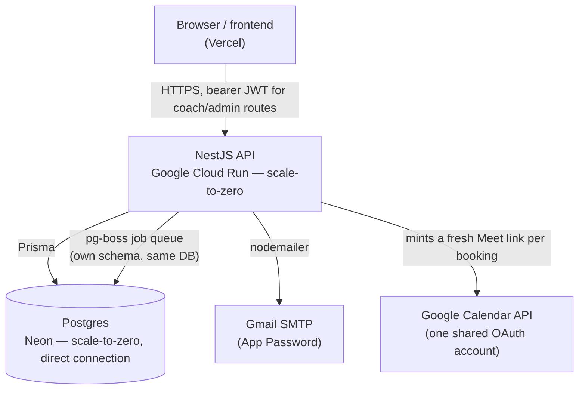
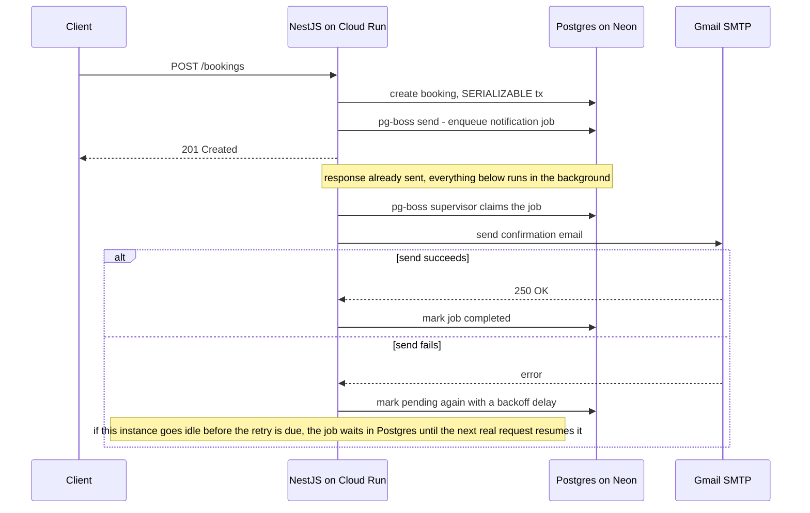

# betti-coaching-calendar

Booking/calendar backend API for the [betti-coaching](https://github.com/gerencserjani/betti-coaching) website — a [NestJS](https://nestjs.com) project.

A single shared booking calendar: coaches each manage their own event types and
weekly availability, clients book without an account, and the whole thing is
modeled loosely on [cal.diy](https://github.com/calcom/cal.diy) (Cal.com's
open-source, MIT-licensed community fork) — much simplified for one frontend.

## System design



Every piece here is chosen to stay inside a generous free tier at this app's
traffic level, not because it's the "correct" way to build a booking system at
scale — see each section below for the specific trade-off accepted and why.
Nothing here needs Redis, a message broker, or an always-on server: the two
serverless pieces (Cloud Run, Neon) both bill for active compute time only,
and both scale to zero between real requests.

## Development

```bash
cp .env.example .env        # then fill in real values, see below
docker compose up -d        # starts Postgres
npm install                 # also runs `prisma generate` via postinstall
npm run db:migrate          # applies the schema to your local Postgres
npm run start:dev
```

The API listens on `PORT` (default 3000). `GET /health` is a plain liveness
check.

## API docs (OpenAPI/Swagger)

Interactive docs: `GET /docs`. Raw spec for tooling/agents: `GET /docs-json`
(also `/docs-yaml`) — generated automatically from the DTOs and controller
decorators (`@nestjs/swagger`'s Nest CLI plugin infers most of it from the
existing TypeScript types and class-validator decorators, no manual
`@ApiProperty()` annotation needed on request DTOs). Endpoints that require a
bearer token are marked `security: [{ bearer: [] }]` in the spec.

**Known gap**: response bodies aren't backed by dedicated DTO classes (they're
mostly raw Prisma model shapes returned straight from services), so response
schemas in the spec are generic (`type: object`) rather than fully typed.
Request bodies, query params, enums, and auth requirements are fully accurate
though — enough for a frontend/agent to know what to send and where.

## Environment variables

See `.env.example` for the full list. Notes on the less obvious ones:

- **`DATABASE_URL`** — read directly by Prisma; matches the credentials in
  `docker-compose.yml` out of the box.
- **`JWT_SECRET`** — signs the app's own login tokens (see "Auth" below).
  32+ random characters; generate with `openssl rand -base64 32`.
- **`GMAIL_USER` / `GMAIL_APP_PASSWORD`** — email is sent through Gmail's own
  SMTP, authenticated as a real Gmail account. This is deliberate, not a
  placeholder: third-party email APIs (Resend, SendGrid, …) can never send
  _from_ a `@gmail.com` address — only Google's own servers are authorized to
  (that's what SPF/DKIM enforce) — so sending through Gmail SMTP directly is
  the correct way to have `EMAIL_FROM` genuinely be a Gmail address. Turn on
  2-Step Verification on that Google account, then generate an **App
  Password** (not the account password) at
  [myaccount.google.com/apppasswords](https://myaccount.google.com/apppasswords).
  `EMAIL_FROM` must be `GMAIL_USER` itself, or a "Send mail as" alias
  configured on that account — Gmail SMTP rejects/rewrites a From address it
  doesn't recognize. Gmail's sending limit is ~500/day on a regular account,
  far above what this app needs.
- **`ENCRYPTION_KEY`** — 32-byte, base64-encoded key used to encrypt the
  stored Google refresh token at rest. Generate with `openssl rand -base64 32`
  (a working dev value is already in `.env`, generate a fresh one for
  production).
- **`GOOGLE_CLIENT_ID` / `GOOGLE_CLIENT_SECRET` / `GOOGLE_OAUTH_REDIRECT_URI`**
  — from a Google Cloud OAuth 2.0 Client (type "Web application"), with the
  Google Calendar API enabled on that project.

## Auth

The app stores its own users — there's no third-party auth provider. A
`Coach` row has an `email` + bcrypt `passwordHash` + `role`
(`ADMIN` or `COACH`). `POST /auth/login` checks the password and returns a
JWT (signed with `JWT_SECRET`, 30-day expiry); send it as
`Authorization: Bearer <token>` on coach/admin routes (`JwtAuthGuard` in
`src/auth/`). `RolesGuard` + `@Roles(CoachRole.ADMIN)` additionally gate
admin-only routes.

There's deliberately no public self-signup and no `ADMIN_EMAIL`/
`ADMIN_PASSWORD` env vars — credentials never touch a `.env`/`env.yaml` file.
Instead:

- **The one admin account** is created by running `node scripts/seed-admin.mjs`
  once, interactively, against whichever `DATABASE_URL` you point it at (local
  or production) — it prompts for email/name/password and stores only the
  bcrypt hash.
- **Additional coach accounts** are created by an admin, via
  `POST /coaches` (admin-only; body: `email`, `name`, `password`).

`passwordHash` is also stripped from every JSON response as a defense-in-depth
measure (`StripPasswordHashInterceptor`, registered globally in `main.ts`),
so it can never leak even from an endpoint that includes a `coach` relation.

## One-time Google Calendar setup (mints fresh Meet links)

Every booking with location `GOOGLE_MEET` gets a **brand-new** Meet room, so a
previous client can never re-enter or linger in an old one. This uses a
single, centrally-connected Google account (yours in dev, the business
account in production) rather than a per-coach connection — see the ADR-style
reasoning in the conversation history if you need the "why".

1. In Google Cloud Console, create an OAuth 2.0 Client ID (Web application)
   with the Calendar scope, and set its redirect URI to
   `GOOGLE_OAUTH_REDIRECT_URI`.
2. Set the OAuth consent screen's publishing status to **"In production"**
   (not "Testing") — otherwise Google expires the refresh token after 7 days.
   Verification isn't required for a single internal account.
3. Visit `GET /admin/google/connect` directly in a browser (it 302s to
   Google's consent screen — not gated behind a login, since a plain browser
   navigation can't carry an `Authorization` header anyway; see the comment
   in `google.controller.ts`). You'll see an "unverified app" warning since
   the app isn't submitted for Google review — click "Advanced → Go to (app
   name) (unsafe)" to proceed; this is safe since you're authorizing your own
   app. Sign in with whichever Google account should mint the Meet links.
4. Google redirects back to `/admin/google/callback`, which stores the
   encrypted refresh token. `GET /admin/google/status` confirms the
   connection.
5. To switch accounts later (e.g. dev → production), just repeat step 3
   signed into a different Google account (or an incognito window) — it
   overwrites the stored token.

## Scripts

- `npm run start:dev` — start with hot reload
- `npm run build` — compile to `dist/`
- `npm run lint` — ESLint
- `npm run format` — Prettier
- `npm run db:migrate` — apply Prisma migrations (dev)
- `npm run db:generate` — regenerate the Prisma client after schema changes
- `npm run db:studio` — Prisma Studio, a GUI for the local database

## Architecture notes

- **Domain model**: each `EventType` (title/description/duration/locations)
  belongs to one coach. Bookable slots for an event type come only from that
  coach's own `WeeklyAvailability` + `AvailabilityOverride`. Clients never
  pick a coach explicitly — they just see a list of open times. `price`
  (whole HUF, optional, defaults to and can never go below 0) and `position`
  (display order in the public catalog, defaults to appended-at-the-end) are
  both editable later via `PATCH /event-types/:id`.
- **Shared-calendar conflict rule**: only one coach may be "on duty" at a
  time. Saving a weekly-hours row or a date override is rejected up front if
  it overlaps another coach's schedule (`AvailabilityService` in
  `src/availability/`) — see `assertNoCrossCoachConflictFor{Weekday,Date}`.
- **Booking race safety**: `BookingsService.create`/`rescheduleByClient` wrap
  the availability + overlap check and the write in a single `SERIALIZABLE`
  Postgres transaction, retried a few times on serialization failure, so two
  simultaneous requests can never double-book the same slot.
- **Client-facing endpoints are public** (no login): `GET /event-types`,
  `GET /slots`, `POST /bookings`, and the whole `/bookings/manage/:token/*`
  self-service flow (cancel/reschedule via a random 32-char token emailed to
  the client, no login).
- **Coach/admin endpoints require a bearer token** from `POST /auth/login`
  (`JwtAuthGuard`, see "Auth" above). Admin-only routes additionally use
  `RolesGuard` + `@Roles(CoachRole.ADMIN)`.
- **Notifications**: nodemailer (Gmail SMTP) + React Email (`src/notifications/templates`),
  bilingual (hu/en) via a small i18next-based service reading flat-key JSON
  files from `src/i18n/locales/`, mirroring the frontend's own i18next setup.
  Every confirmation/reschedule email carries a `.ics` attachment (works in
  Apple/Outlook/Google) plus a Google Calendar "quick add" link. Sending is
  queued and retried, not fire-and-forget — see "Background jobs" below. The
  email HTML mirrors the frontend's brand (colors/fonts from
  `betti-coaching/src/index.css`'s custom properties, both light and
  dark-mode variants) — see the comment above the `light`/`dark` palette
  constants in `BookingEmail.tsx` if that palette changes and the email needs
  updating to match.
- **Cancellation/reschedule**: only the client can reschedule (self-service);
  a coach can only cancel, with a mandatory reason. Both are blocked within
  `Settings.cancellationNoticeHours` (default 48h) of the appointment for
  client-initiated changes; coaches aren't bound by that window.

## Background jobs

Booking confirmation/cancellation/reschedule emails go through a durable
queue (`src/jobs/`), not a fire-and-forget async call. Why, and why it looks
the way it does, is worth documenting because the "obvious" answer
(Redis + BullMQ, or a cron-triggered worker) was deliberately rejected.

**Why a queue at all.** The old code sent email inline and swallowed failures
with `.catch(logger.error)`. If Gmail SMTP hiccuped, or the process got torn
down mid-send (which happens routinely on Cloud Run's scale-to-zero), the
email was just gone - nothing durable recorded the attempt.

**Why `pg-boss` and not Redis/BullMQ.** A queue is a table with a good
locking strategy (`FOR UPDATE SKIP LOCKED`) more than it's a new category of
infrastructure. [`pg-boss`](https://github.com/timgit/pg-boss) implements
that on top of the Postgres we already have - no new service to provision,
pay for, or keep patched. It also means enqueueing can never silently lose a
job the way a separate Redis call could: worst case, Postgres itself is down,
in which case nothing else in the app works either.

**Why there's no scheduler/cron driving it.** This was the actual design
question, worked through at length in this project's history - short
version:



A dedicated scheduler (Google Cloud Scheduler, or Neon's own Function
Triggers) was considered and dropped, for two reasons:

1. **It doesn't remove the real constraint.** Whoever calls the queue still
   has to query Postgres to do it, and that query is what keeps Neon's
   compute from auto-suspending. A scheduler polling every minute would burn
   through Neon's 100 CU-hour/month free allowance in days (continuous
   compute ≈ 720 hours/month vs. the 100-hour budget) - the trigger source
   doesn't change that math, only who initiates the same expensive query.
2. **`pg-boss`'s own retry policy doesn't need one.** `retryLimit: 3,
retryDelay: 5, retryBackoff: true` (see `notification-jobs.service.ts`)
   means a failed send is automatically retried a few times with growing
   backoff, for as long as the process instance that enqueued it happens to
   stay alive - which, immediately after a real request, it usually does for
   at least a little while. If it doesn't finish before the instance goes
   idle, the job's state is safely persisted in Postgres and resumes on the
   next real request, rather than being lost.

The accepted trade-off: **a failed send's retry timing isn't guaranteed** -
in the worst case (no traffic at all for a while) a retry waits for the next
real visitor. For a low-traffic booking site, and given the first attempt is
still synchronous/immediate on the happy path, this was judged an acceptable
cost for avoiding a second piece of paid/managed infrastructure. If traffic
or reliability requirements ever grow past this, the documented upgrade path
is either a Cloud Scheduler-triggered `/internal/process-jobs` endpoint, or
(if `pg-boss` itself becomes the bottleneck) a proper Redis-backed queue -
both are drop-in replacements for `NotificationJobsService`, not a rewrite of
`BookingsService`.

## Production hosting (Neon + Cloud Run)

The app is deployed as a container (`Dockerfile` at the repo root) to
[Google Cloud Run](https://cloud.google.com/run), backed by a free
[Neon](https://neon.com) Postgres database — both stay within their
always-free tiers at this app's traffic level. See the write-up on why these
two (and not Render/Railway/Fly.io) in the project conversation history if
you need the reasoning.

Run `bash scripts/setup-production.sh` **directly in Git Bash** (not via
PowerShell calling `bash`, and not through an AI-assistant's one-shot command
runner — it's fully interactive across 8 stages and needs a real TTY you can
type into) for a guided, re-runnable walkthrough: gcloud CLI setup, GCP
project/billing, Neon database creation, the Google OAuth client for Meet
links, the Gmail App Password, and the first `gcloud run deploy`. It writes secrets to
`.env.production` and `env.yaml` (both gitignored, kept separate from the
local-dev `.env`) and remembers what you've already entered if you stop and
re-run it. The very last thing it prompts for is running
`node scripts/seed-admin.mjs` against production — see "Auth" above.

## Known follow-ups

- `npm audit` flags 4 high-severity advisories, all inside Prisma's own CLI
  tooling (`mysql2`/`deepmerge-ts`, pulled in even though we only use
  Postgres) — not reachable from the running app. `npm audit fix --force`
  would downgrade Prisma to 6.x; not done here on purpose.
- The frontend needs a page at `${FRONTEND_URL}/bookings/manage?token=...`
  (linked from emails) for clients to view/cancel/reschedule their booking.

## Releases

Versioning and releases are automated via [semantic-release](https://semantic-release.gitbook.io/) from [Conventional Commits](https://www.conventionalcommits.org/) on `main` (see `.github/workflows/release.yml`).
